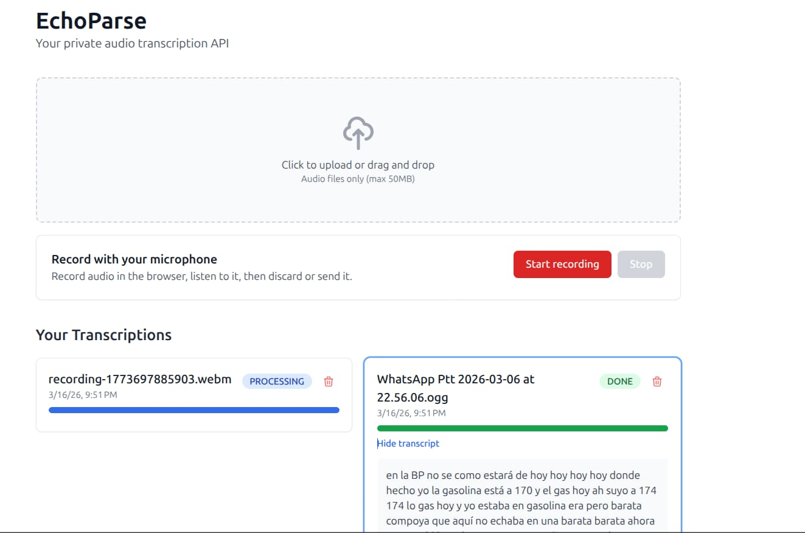

# 🎙️ EchoParse




> **Tu propia API de transcripción y análisis de audio privada, contenerizada y asíncrona.**

**EchoParse** es una solución de código abierto diseñada para transcribir y analizar archivos de audio (reuniones, podcasts, notas de voz) utilizando el modelo de IA **Whisper** de forma local.

A diferencia de las APIs comerciales que cobran por minuto y requieren enviar tus datos a la nube, EchoParse corre en tu propia infraestructura (o en tu portátil) gracias a **Docker**, garantizando **privacidad total** y **coste cero** por uso.

## Cómo iniciar el proyecto

Para levantar todo el entorno, primero necesitas clonar el repositorio:

```bash
git clone https://github.com/CarrasCode/EchoParse.git
cd EchoParse
```

### Configuración del Modelo de IA (Whisper)

Puedes elegir qué modelo de IA usar modificando tu archivo `.env` (crea uno basado en `.env.example` si no lo tienes). Por defecto, usamos el modelo **`turbo`**, ya que es la opción óptima para transcripciones rápidas y precisas en español.

```env
WHISPER_MODEL=turbo
WHISPER_LANGUAGE=es
```

_Idioma: `es` (por defecto) es lo más eficiente para español. Bórralo o déjalo vacío para que la IA auto-detecte el idioma._

**Modelos permitidos y opciones según tu VRAM:**
* **`turbo` (Recomendado)**: ~6 GB VRAM. _(4x más rápido, precisión premium)_
* **`medium`**: ~5 GB VRAM. _(Requerido si quieres traducir audio ES ➔ texto EN)_
* **`large`**: ~10 GB VRAM.
* **`small` / `base` / `tiny`**: ~2 GB a ~1 GB VRAM.

Una vez ubicado en la raíz del proyecto y configurado el entorno, con Docker instalado, ejecuta el siguiente comando:

```bash
docker compose up
```

Una vez que los contenedores estén en marcha, podrás acceder a la aplicación desde tu navegador en http://localhost:4200/.

